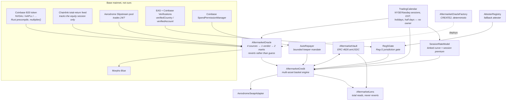

# Aftermarket

**A portfolio line of credit against Coinbase's tokenized US stocks on Base, whose oracle refuses to
produce a mark it cannot defend, and whose credit engine will not seize collateral while the US
market is shut.**

Base mainnet · chainId 8453 · every contract source-verified · MIT

**Live demo: <https://aftermarket-fawn.vercel.app>** — the landing page and all seven app screens,
reading Base mainnet live.

**Demo video (2:56): <https://youtu.be/ix3a1fEQlV8>** — the measurement, the refusal, and the two calls that reproduce it.

---

## The measurement this was built around

On Sunday **2026-09-06 at 22:17 ET**, at Base block **50,979,049**, we read all thirteen priced
Coinbase B20 tokenized equities on Base, their Chainlink total-return feeds, and the Aerodrome
Slipstream pools those tokens actually trade in. Ten of the thirteen have a pool. Here is what the
feeds said versus what the market said:

| asset | Chainlink feed | Aerodrome 30-min TWAP | divergence | feed age |
|---|---:|---:|---:|---:|
| **AMZNc** | $257.69 | $281.10 | **912 bps** | 54.2 h |
| **MSFTc** | $499.78 | $523.79 | **479 bps** | 58.6 h |
| **SNDKc** | $1732.87 | $1770.87 | **221 bps** | 54.0 h |
| **SPCXc** | $148.10 | $150.59 | **154 bps** | 54.4 h |
| **MSTRc** | $142.63 | $144.89 | **153 bps** | 52.8 h |
| NVDAc | $229.96 | $231.40 | 62 bps | 56.2 h |
| TSLAc | $353.33 | $355.53 | 62 bps | 54.2 h |
| METAc | $615.23 | $613.87 | 22 bps | 55.1 h |
| AAPLc | $320.08 | $320.70 | 19 bps | 54.3 h |
| GOOGLc | $338.71 | $338.56 | 4 bps | 59.9 h |

Snapshot: [`docs/evidence/weekend-2026-09-06.json`](docs/evidence/weekend-2026-09-06.json). Regenerate
the live version with `pnpm verify:onchain`.

Five of the ten priced markets were more than 150 bps away from the number a Chainlink-only lender
would have marked them at, and one of them was **9.1% away**. The feeds were not broken. They were
doing exactly what they are specified to do: a total-return reference feed for a US equity tracks the
US equity market, and the US equity market was closed. The token, meanwhile, kept trading.

That gap is not an edge case. The NYSE is open **32.5 hours a week**. For the other 135.5 hours the
tokens trade and the reference does not move at all — `updatedAt` is frozen at the last close, so the
usual `block.timestamp - updatedAt > heartbeat` staleness check cannot tell "quiet market" from
"broken feed". Every weekend, every overnight, every holiday, a protocol reading that feed directly
will lend against a price that is up to four days old, and will liquidate against it too.

Aftermarket is a lending protocol built on the premise that **the correct answer, most of the week,
is to refuse to answer** — and that refusing correctly is worth more than guessing confidently.

---

## What it does

You post Coinbase tokenized stocks (NVDAc, AAPLc, METAc, GOOGLc, TSLAc, AMZNc) as collateral and
draw USDC against the basket. Two things make it different from every other lending market:

**1. The oracle has a verdict, not just a number.** `AftermarketOracle` fuses four onchain sources —
the Chainlink anchor, an Aerodrome Slipstream 30-minute TWAP, the B20 `multiplier()` corporate-action
signal, and an onchain NYSE/Nasdaq calendar — into one of six verdicts and two deliberately
asymmetric marks. When it cannot defend a mark it **reverts with a typed error** rather than
returning a stale number.

```
TRUSTED               open session, feed fresh, sources agree
TRUSTED_CLOSED        market closed as expected, sources agree, gap haircut applied
UNTRUSTED_STALE       feed older than this session's budget
UNTRUSTED_DIVERGENT   the reference and the live pool disagree beyond the band
UNTRUSTED_THIN        the pool is too shallow to corroborate a frozen feed
UNTRUSTED_HALTED      corporate action in flight (multiplier moved / issuer paused)
```

**2. The refusal is load-bearing, not decorative.** The oracle implements Morpho Blue's `IOracle`.
Morpho reads `price()` in exactly three places, and we checked the audited source:

| Morpho Blue function | reads `price()` | file:line |
|---|---|---|
| `borrow` | yes | `lib/morpho-blue/src/Morpho.sol:258` → `_isHealthy` → `:518` |
| `withdrawCollateral` | yes | `Morpho.sol:337` → `_isHealthy` → `:518` |
| `liquidate` | yes | `Morpho.sol:361` |
| `supply`, `withdraw`, `repay`, `supplyCollateral` | **no** | — |

So an oracle that reverts **freezes new risk and freezes seizure while leaving the cure open**. A
borrower can always repay, always add collateral, always get out. Nobody can take. That is not
behaviour we wrote — it is inherited from Morpho's own audited code, and our engine reproduces it
deliberately for the basket case Morpho's single-collateral market does not cover.

The same asymmetry runs through the marks:

```
markBorrow    = min(anchor, pool) × (1 − haircut)     pessimistic: the pool can only lower your power
markLiquidate = max(anchor, pool) × (1 + haircut)     optimistic: the pool can only raise the bar to seize you
```

with the gap haircut widening at 15 bps per closed hour on top of a 25 bps base, capped at 500 bps.
On a normal Friday close the seizure threshold is *higher* than the borrowing power that created the
position, which is the point: while the market is shut, the protocol becomes strictly harder to be
liquidated by, not easier.

---

## What that looks like right now, on mainnet

Monday 2026-09-07 is Labor Day. The market closed Friday at 16:00 ET and does not reopen until
Tuesday 09:30 ET — **89 h 30 m between two real prints**. Three read-only calls, no wallet:

```bash
export RPC=https://mainnet.base.org

# 1. NVDAc: sources agree (105 bps inside a 300 bps band) -> it answers, haircut and all
cast call 0x1E2b20B4703F97710c2600eA73179c6CD1E00b02 "price()(uint256)" --rpc-url $RPC
# 2184594350000000000000000000000000000   ($218.46, from a $229.96 anchor, 500 bps gap haircut)

# 2. AMZNc: sources disagree by 898 bps against a 300 bps band -> it refuses
cast call 0x6FEEF51B6352895B17AEf6a4F36F8A9b76A3bb5C "price()(uint256)" --rpc-url $RPC
# execution reverted: SourcesDiverged(session=5 CLOSED_HOLIDAY, divergence=898, band=300)

# 3. Negative control: the same NVDAc, one constructor number different (band 25 bps) -> it refuses
cast call 0x82eAc15172A7EFd9e06633F9bcaaE5180c12dd58 "price()(uint256)" --rpc-url $RPC
# execution reverted: SourcesDiverged(session=5 CLOSED_HOLIDAY, divergence=106, band=25)
```

The third one matters most. `0x82eAc15…dd58` is an `AftermarketOracle` deployed against the **same**
NVDAc token, the **same** Chainlink feed, the **same** Aerodrome pool, the **same** calendar, at the
**same** block — differing only in the divergence band. It refuses where production answers. It is a
green check that could have been red, and it is on chain so you can check that it is.

### The headline: an unmarkable asset is worth exactly zero borrowing power

The demo line holds two collateral assets: 0.00515351 NVDAc (which the oracle marks) and
0.00356308 AMZNc (which it refuses to mark). Two archive calls at adjacent blocks, before and after
the AMZNc collateral deposit landed:

```bash
# block 50991631 — before the AMZNc deposit
cast call 0xD5d4A08CA636C06a60Ea4e6266807cb8D994Ee93 "draw(uint256,address)" \
  900000 0x0AF7aFC75Db0CdEC3019CbAf4C67f311fEEC5c8f \
  --from 0x0AF7aFC75Db0CdEC3019CbAf4C67f311fEEC5c8f --rpc-url $RPC --block 50991631
# Undercollateralized(900000, 562916)

# block 50991632 — after the AMZNc deposit
... --block 50991632
# Undercollateralized(900000, 562916)
```

**562,916 → 562,916.** Depositing a dollar of an asset the oracle refuses to mark added exactly zero
borrowing power. The AMZNc is still held, still withdrawable, still unseizable — it simply does not
count. That is the design in one number: an outage is a freeze, never a loss and never a licence.

And in the other direction, `flag()` on that same line reverts `LineHealthy(500007, 1069403)` — the
seizure threshold (1.07 USDC) is more than **double** the debt (0.50 USDC), because `markLiquidate`
is the optimistic mark and the closed-session liquidation threshold (8500 bps) is *higher* than the
open one (8000 bps).

Full reproduction commands, with every current value: **[PROOF.md](PROOF.md)**.

---

## Architecture



Two consumers of the same oracle, on purpose. **Morpho Blue** gets a plain `IOracle` and a
single-collateral NVDAc/USDC market, so the refusal behaviour is demonstrated against code we did not
write. **`AftermarketCredit`** is our own engine, which exists because Morpho markets are
single-collateral and a portfolio line is not: it holds a basket of up to eight assets (`MAX_ASSETS`)
against one USDC debt, and it is where the interesting version of the problem lives — what does a
basket do when one oracle goes dark? (Answer: that asset contributes zero to borrowing power *and*
zero to the seizure threshold, and can never be seized. See [the audit, A-02](contracts/audit/AUDIT.md).)

### Deployed contracts — Base mainnet, all verified

| Contract | Address | Source |
|---|---|---|
| `TradingCalendar` | [`0x9a29F81D…EE0Dd9`](https://repo.sourcify.dev/8453/0x9a29F81D951fE40ae3C937654bB73f0493EE0Dd9) | [Sourcify](https://repo.sourcify.dev/8453/0x9a29F81D951fE40ae3C937654bB73f0493EE0Dd9) · [Blockscout](https://base.blockscout.com/address/0x9a29F81D951fE40ae3C937654bB73f0493EE0Dd9?tab=contract) |
| `AttesterRegistry` | [`0x53a64E3A…7D361E`](https://repo.sourcify.dev/8453/0x53a64E3AF9B89386915E66cE810a1d9DDc7D361E) | [Sourcify](https://repo.sourcify.dev/8453/0x53a64E3AF9B89386915E66cE810a1d9DDc7D361E) · [Blockscout](https://base.blockscout.com/address/0x53a64E3AF9B89386915E66cE810a1d9DDc7D361E?tab=contract) |
| `RegSGate` | [`0xF87B4d3a…dD67C`](https://repo.sourcify.dev/8453/0xF87B4d3a2f50712d8442aa58Ca0F870E51ddD67C) | [Sourcify](https://repo.sourcify.dev/8453/0xF87B4d3a2f50712d8442aa58Ca0F870E51ddD67C) · [Blockscout](https://base.blockscout.com/address/0xF87B4d3a2f50712d8442aa58Ca0F870E51ddD67C?tab=contract) |
| `SessionRateModel` | [`0x6d5152d8…3a2343`](https://repo.sourcify.dev/8453/0x6d5152d81982DEb660736fC514761E18533a2343) | [Sourcify](https://repo.sourcify.dev/8453/0x6d5152d81982DEb660736fC514761E18533a2343) · [Blockscout](https://base.blockscout.com/address/0x6d5152d81982DEb660736fC514761E18533a2343?tab=contract) |
| `AftermarketOracleFactory` | [`0xD10f2f4a…1c1f8A`](https://repo.sourcify.dev/8453/0xD10f2f4a4e9052fD3fa87aAFC529983EdB1c1f8A) | [Sourcify](https://repo.sourcify.dev/8453/0xD10f2f4a4e9052fD3fa87aAFC529983EdB1c1f8A) · [Blockscout](https://base.blockscout.com/address/0xD10f2f4a4e9052fD3fa87aAFC529983EdB1c1f8A?tab=contract) |
| `AerodromeSwapAdapter` | [`0x71283dB3…A8465E`](https://repo.sourcify.dev/8453/0x71283dB3a0b784F0B9e9B0dFc2398877D0A8465E) | [Sourcify](https://repo.sourcify.dev/8453/0x71283dB3a0b784F0B9e9B0dFc2398877D0A8465E) · [Blockscout](https://base.blockscout.com/address/0x71283dB3a0b784F0B9e9B0dFc2398877D0A8465E?tab=contract) |
| `AftermarketCredit` | [`0xD5d4A08C…94Ee93`](https://repo.sourcify.dev/8453/0xD5d4A08CA636C06a60Ea4e6266807cb8D994Ee93) | [Sourcify](https://repo.sourcify.dev/8453/0xD5d4A08CA636C06a60Ea4e6266807cb8D994Ee93) · [Blockscout](https://base.blockscout.com/address/0xD5d4A08CA636C06a60Ea4e6266807cb8D994Ee93?tab=contract) |
| `AftermarketVault` | [`0x00ee9924…bd2697`](https://repo.sourcify.dev/8453/0x00ee99240Ad9a4b25DD06eAcD1b852C83fbd2697) | [Sourcify](https://repo.sourcify.dev/8453/0x00ee99240Ad9a4b25DD06eAcD1b852C83fbd2697) · [Blockscout](https://base.blockscout.com/address/0x00ee99240Ad9a4b25DD06eAcD1b852C83fbd2697?tab=contract) |
| `AutoRepayer` | [`0xBe1EA7CA…0A2404`](https://repo.sourcify.dev/8453/0xBe1EA7CA0Fabc93F86C43fBcB25bbB3f2a0A2404) | [Sourcify](https://repo.sourcify.dev/8453/0xBe1EA7CA0Fabc93F86C43fBcB25bbB3f2a0A2404) · [Blockscout](https://base.blockscout.com/address/0xBe1EA7CA0Fabc93F86C43fBcB25bbB3f2a0A2404?tab=contract) |
| `AftermarketLens` | [`0x27BFaddE…A6735D`](https://repo.sourcify.dev/8453/0x27BFaddEc57fF76d498Ef1a7b09C5951DeA6735D) | [Sourcify](https://repo.sourcify.dev/8453/0x27BFaddEc57fF76d498Ef1a7b09C5951DeA6735D) · [Blockscout](https://base.blockscout.com/address/0x27BFaddEc57fF76d498Ef1a7b09C5951DeA6735D?tab=contract) |

Six production oracles and one negative control, all `AftermarketOracle`, all verified on Sourcify:

| oracle | address |
|---|---|
| NVDAc | [`0x1E2b20B4703F97710c2600eA73179c6CD1E00b02`](https://repo.sourcify.dev/8453/0x1E2b20B4703F97710c2600eA73179c6CD1E00b02) |
| AAPLc | [`0x6cE58FE71eD10b82c2C0A9a348E82D1ee6D9a8dc`](https://repo.sourcify.dev/8453/0x6cE58FE71eD10b82c2C0A9a348E82D1ee6D9a8dc) |
| METAc | [`0xf5Cc0cc94ecF4866661373f2aa066af76e08dEf2`](https://repo.sourcify.dev/8453/0xf5Cc0cc94ecF4866661373f2aa066af76e08dEf2) |
| GOOGLc | [`0x203cDf7e33eA0d652cA54f4807c9d2d1d081C9aA`](https://repo.sourcify.dev/8453/0x203cDf7e33eA0d652cA54f4807c9d2d1d081C9aA) |
| TSLAc | [`0x74058d51B3b04Ba09be2aa51ab1CE930Dd3c2C99`](https://repo.sourcify.dev/8453/0x74058d51B3b04Ba09be2aa51ab1CE930Dd3c2C99) |
| AMZNc | [`0x6FEEF51B6352895B17AEf6a4F36F8A9b76A3bb5C`](https://repo.sourcify.dev/8453/0x6FEEF51B6352895B17AEf6a4F36F8A9b76A3bb5C) |
| **negative control** (NVDAc @ 25 bps) | [`0x82eAc15172A7EFd9e06633F9bcaaE5180c12dd58`](https://repo.sourcify.dev/8453/0x82eAc15172A7EFd9e06633F9bcaaE5180c12dd58) |

Morpho Blue market `0xfef5641f70e19a87e369304daa9ba823754f3db1e6481d757fcae0442cffe479`
(USDC / NVDAc / our oracle / AdaptiveCurveIRM / 77% LLTV). Funded with a real supply, collateral
deposit and borrow — **not with any volume**: one supplier, one borrower, both the deployer, $0.50
total — see [CLAIMS.md](CLAIMS.md) and [PROOF §11](PROOF.md).

Machine-readable manifest with constructor arguments:
[`contracts/deployments/8453.json`](contracts/deployments/8453.json).
Verification record and how to re-run it: [`docs/verification.md`](docs/verification.md).

> **Verified where, exactly.** All 17 are `exact_match` on Sourcify. Five of the top-level contracts
> are also on Blockscout; the other five were redeployed on 2026-09-07 for the Reg-S changes below and
> could not be submitted, because `base.blockscout.com/api` has been returning 503 to every request
> since.   The seven oracles are **not** on Blockscout and could not be made to be: they
> were created by `CREATE2` from inside the factory, Blockscout indexed no creation transaction for
> them, and its verifier matches on creation bytecode. Sourcify matches *runtime* bytecode too, which
> is the match that proves the code running at those addresses is the code in this repository.
> **Basescan will show all of these as unverified** — we had no API key, so every verification here is
> key-less. `scripts/verify-sources.sh status` prints the live truth from both verifiers.

---

## Run it

Requirements: Node ≥ 20.9, pnpm 9, [Foundry](https://book.getfoundry.sh/getting-started/installation),
and — for the fork tests only — [`base-forge`](https://github.com/base/base-anvil), because B20 tokens
are Rust precompiles rather than EVM contracts and stock `forge` halts with `OpcodeNotFound` on the
first `decimals()` call.

```bash
pnpm install
cp .env.example .env          # defaults work; a private archive RPC is faster and rate-limit free
pnpm verify:onchain           # the live evidence table above, regenerated from Base right now
```

That one command needs no key, no wallet and no deploy. It reads Base mainnet and prints the current
feed-vs-pool divergence for every listed tokenized stock. If the number in the table at the top of
this README has moved since we wrote it, this is how you find out.

> It makes about eighty calls. On the public `https://mainnet.base.org` endpoint that can trip the
> rate limiter, in which case the table fills with `unavailable` and `NO-POOL` — that is the RPC
> refusing, not the chain. Set `BASE_RPC_URL` to your own endpoint, or narrow it with
> `node scripts/verify-onchain.mjs --asset NVDAc`.

Everything else:

```bash
pnpm build                                     # all workspace packages
cd contracts && forge test --no-match-path 'test/fork/*'      # 273 passed, 0 failed, 1 skipped
cd contracts && FOUNDRY_TEST=audit/poc forge test             #  43 passed, 0 failed
cd contracts && BASE_RPC_URL=… base-forge test --match-path 'test/fork/*'   # 8 passed, 0 failed
cd web && pnpm dev                             # the app, on http://localhost:3000
```

### Environment

| variable | required for | default | notes |
|---|---|---|---|
| `BASE_RPC_URL` | fork tests, `pnpm verify:onchain`, deploys | `https://mainnet.base.org` | must be an **archive** node for `test/fork/WeekendReplay.t.sol`, which pins blocks ~100k deep |
| `BASE_SEPOLIA_RPC_URL` | testnet deploys | `https://sepolia.base.org` | |
| `DEPLOYER_PRIVATE_KEY` | deploys only | — | never needed to review this repo |
| `BASESCAN_API_KEY` | nothing | — | present in `foundry.toml` for completeness; **all published verification was done key-less** via Sourcify and Blockscout |
| `NEXT_PUBLIC_SITE_URL` | web app | `http://localhost:3000` | drives OG tags, manifest, SIWE domain check |
| `NEXT_PUBLIC_BASE_RPC_URL` | web app | `/api/rpc` | where the browser sends its Base reads; unset, they go through the app's own read proxy, which forwards an allowlist of read methods to `BASE_RPC_URL` and keeps any key out of the client bundle |
| `NEXT_PUBLIC_BUILDER_CODE` | web app | — | ERC-8021 Builder Code from base.dev; unset means transactions go out unattributed |
| `SESSION_SECRET` | web app | random per process | signs the session cookie |
| `KEEPER_ACCOUNTS`, `--account` | keeper | — | pins accounts for the `AutoRepayer` keeper in addition to event discovery |

---

## The integrator surface

`AftermarketOracle` is a plain Morpho Blue `IOracle`. If that is all you want, point a market at one
of the addresses above and you are done. If you want the verdict rather than just the number:

**[`@aftermarket/session-oracle`](packages/session-oracle)** — typed `Quote` decoding, decoded
custom-error results (never a raw revert blob), Morpho 1e36 scale helpers, plain-English verdict
explanations, and optional React/wagmi hooks.

```ts
import { createPublicClient, http } from "viem";
import { base } from "viem/chains";
import { createOracleClient, morphoPriceToUsd } from "@aftermarket/session-oracle";

const publicClient = createPublicClient({ chain: base, transport: http() });
const oracle = createOracleClient({ publicClient, address: "0x6FEEF51B6352895B17AEf6a4F36F8A9b76A3bb5C" });

const quote = await oracle.peek();          // never reverts — full state for a UI or a keeper
const result = await oracle.price();        // reverts onchain -> decoded error here instead
if (result.ok) {
  console.log(morphoPriceToUsd(result.price, 8, 6));
} else {
  console.log(result.error.name);           // "SourcesDiverged" | "StaleFeed" | "PoolTooThin" | …
}
```

Companion packages: **[`@aftermarket/session-oracle-solidity`](packages/session-oracle-solidity)**
(frozen `IAftermarketOracle` / `ITradingCalendar` / `Quote` interfaces, no dependency on the rest of
this repo) and **[`@aftermarket/observer`](packages/observer)** (the CLI behind `pnpm verify:onchain`).

---

## Honest limits

We would rather you read these here than find them yourself.

- **~19% of every week, this protocol has no working oracle at all, by construction.** A Coinbase
  equity feed only prints during the regular session, so by the time the PRE session opens at 04:00 ET
  the feed is already 12 hours old against a 6-hour PRE budget — and it only gets worse until the
  bell. Result: `UNTRUSTED_STALE` for all **5.5 hours of PRE every weekday**, plus the **four hours of
  Monday overnight** (00:00–04:00 ET, 56 hours after Friday's close against a 25-hour budget). That is
  roughly 19% of the week in which `draw`, `withdrawCollateral`, `flag`, `cure` and `liquidate` revert
  for every user of every asset. `repay`, `supplyCollateral` and `deposit` read no oracle and stay
  open, so it is a freeze rather than a trap — but it is a real cost to real users, it is our own
  finding [A-17](contracts/audit/AUDIT.md), and we accepted it deliberately rather than widen the
  budgets and mark collateral against a seventeen-hour-old print. The exact config change that
  reverses the trade-off is written into the contract's own NatSpec. It also costs us the one
  keeper-favourable flag window in the design: PRE is the only session where `nextOpen` returns
  *today's* bell, and it is permanently unusable.
- **The trading calendar ends on 2027-12-31** (seeded days 20444–21183, readable on chain). Past the
  horizon it fails closed: every instant reports `CLOSED_HOLIDAY`, nothing can be drawn and nothing
  can be seized. It cannot be extended in place; reaching it means redeploying the calendar, every
  oracle and the engine.
- **The owner key is a single EOA and is not timelocked.** `0x0AF7aFC7…C5c8f` can repoint any oracle,
  rate model or swap venue on `AftermarketCredit`. `setAsset` validates that the oracle it installs
  actually prices the asset it is installed for, which removes the accidental version of the worst
  case, but not the malicious one. This should be a timelocked multisig on day one and it is not. The
  one thing that key cannot do is move the compliance gate: `eligibility` is immutable and there is no
  `setEligibility`.
- **The jurisdiction gate is real in bytecode and narrower than it sounds.** Every path by which this
  protocol moves a tokenized security into an account is gated: `openLine`, `depositCollateral` and
  `draw` on the caller, and `liquidate` on the account the seized collateral is transferred to. Paths
  out are never gated, because a compliance rule that can trap somebody's collateral is a bug. The
  engine's gate address is immutable and `RegSGate` can never un-restrict `US`. **What is not
  guaranteed:** the registry behind the gate is still owner-settable and its owner is implicitly an
  attester, so a jurisdiction can be *asserted* by our key rather than *proven* by Coinbase - which is
  exactly what the demo account does, and the gate says so on chain by reporting `source = 2`.
  [CLAIMS.md](CLAIMS.md) claims 68-74 state each half separately.
- **The Morpho Blue market is funded but tiny.** A real supply, a real collateral deposit and a real
  borrow — Morpho's own health check called our `price()` to authorise it — but one supplier, one
  borrower, both the deployer, $0.50 total. It proves the `IOracle` integration end to end; it is not a
  liquid market and we do not claim it is one. [PROOF §11](PROOF.md).
- **Two of the six listed Aerodrome pools are thin.** In the Sunday snapshot AMZNc held about $55k of
  USDC and TSLAc about $67k, against $1.9M for NVDAc. The oracle has a $25,000 depth floor and refuses
  below it, and it measures depth as in-range liquidity rather than a raw balance — but a $25k floor
  is a floor, not a guarantee that the corroborating source is expensive to move.
- **Eligibility in the live demo is attested through our own registry, not Coinbase's.** The Coinbase
  read path is real and proven against a real attested address — see [MOCKS.md](MOCKS.md), which draws
  that line precisely, along with two other places where the demo is not the production path.
- **This has not been audited by a third party.** It has been audited hard by us, adversarially, with
  a runnable PoC for every finding: [`contracts/audit/AUDIT.md`](contracts/audit/AUDIT.md) — 3 High,
  11 Medium, 2 Low, 1 Informational, plus fifteen attacks that were tried and failed. Fourteen
  findings are fixed in code, one is mitigated, three behaviours are accepted by design and
  documented in the contracts. A second adversarial pass over the fixes themselves found six more
  problems in the fixes and left two written-down residuals. That is not the same thing as an
  external audit and we are not claiming it is.

---

## Repository

```
contracts/            Foundry project — src, tests, deploy scripts, self-audit
  src/                the ten contracts above
  test/               unit + invariant suite (255 tests)
  test/fork/          live-mainnet and historical-replay suites (base-forge)
  audit/              AUDIT.md and the runnable PoC for every finding
  deployments/8453.json   addresses, constructor args, deploy block
web/                  Next.js 16 app — markets, line, borrow, earn, oracle, auto-repay, activity
agent/                the AutoRepayer keeper (no LLM in the decision path) + its 32-scenario eval
packages/session-oracle           integrator SDK (TypeScript + React)
packages/session-oracle-solidity  frozen Solidity interfaces
packages/observer                 the on-chain evidence CLI
docs/                 verification record and block-pinned evidence
scripts/              verify:onchain, contract source verification
```

## Documents

| file | what it is |
|---|---|
| **[PROOF.md](PROOF.md)** | every claim as a live link or a command you can paste |
| **[CLAIMS.md](CLAIMS.md)** | the honesty ledger: every public statement tagged by evidence tier, plus what we explicitly do **not** claim |
| **[MOCKS.md](MOCKS.md)** | the exact line between what is real on mainnet and what is simulated |
| **[JUDGES.md](JUDGES.md)** | review this in five minutes, in the right order |
| **[docs/verification.md](docs/verification.md)** | contract-by-contract source verification record |
| **[contracts/audit/AUDIT.md](contracts/audit/AUDIT.md)** | the self-audit |
| **[contracts/test/fork/README.md](contracts/test/fork/README.md)** | why the fork suite needs `base-forge` |

## Licence

MIT. See [LICENSE](LICENSE).
